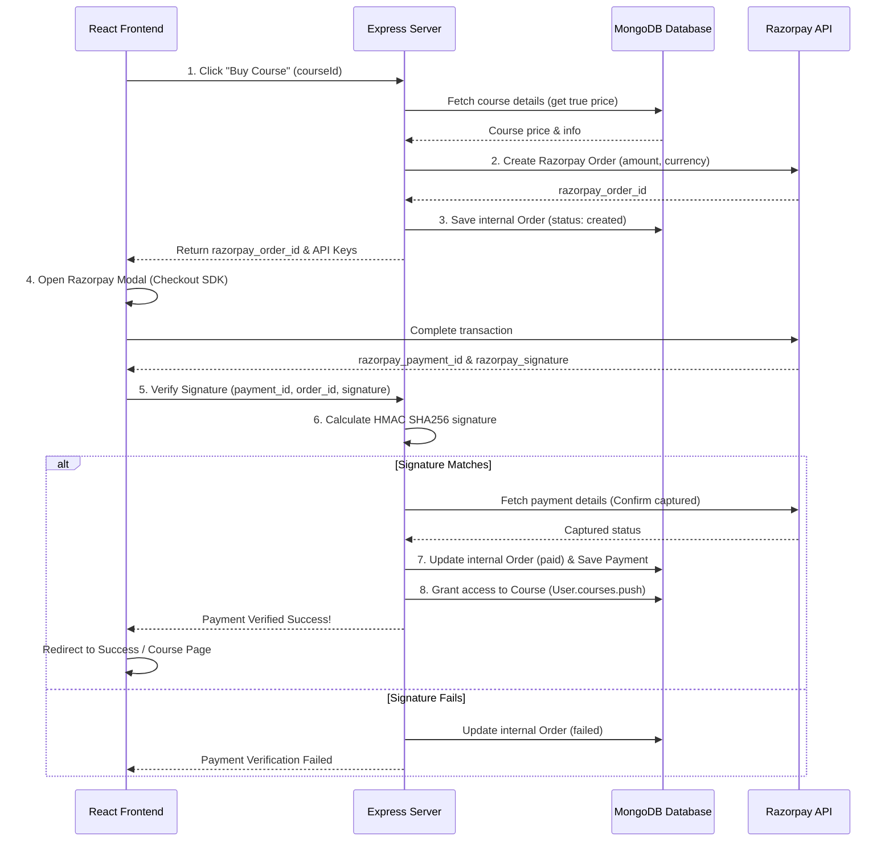

# 💳 Razorpay Payment Gateway Integration Guide for Course Purchases

This guide outlines a production-ready, highly secure full-stack payment flow using **React** (frontend) and **Node.js/Express/Mongoose** (backend) with **Razorpay**. 

It is designed to prevent common vulnerabilities (like price manipulation on the frontend) by verifying all amounts and transaction signatures server-side.

---

## 🔄 The Secure Payment Lifecycle


---

## 🛠️ Backend Implementation (Node.js & Express)

### 1. Razorpay Client Initialization (`config/razorpay.js`)
```javascript
const Razorpay = require('razorpay');

let instance = null;

const getRazorpay = () => {
  if (instance) return instance;

  const keyId = process.env.RAZORPAY_KEY_ID;
  const keySecret = process.env.RAZORPAY_KEY_SECRET;

  if (!keyId || !keySecret) {
    throw new Error('Razorpay keys are not configured in environment variables.');
  }

  instance = new Razorpay({
    key_id: keyId,
    key_secret: keySecret,
  });

  return instance;
};

module.exports = getRazorpay;
```

### 2. Database Models (`models/Order.js` & `models/Payment.js`)
```javascript
// models/Order.js
const mongoose = require('mongoose');

const orderSchema = new mongoose.Schema(
  {
    orderId: { type: String, required: true, unique: true, index: true },
    amount: { type: Number, required: true }, // in paise (e.g. ₹500.00 = 50000)
    currency: { type: String, default: 'INR' },
    status: { type: String, enum: ['created', 'paid', 'failed'], default: 'created' },
    user: { type: mongoose.Schema.Types.ObjectId, ref: 'User', required: true },
    course: { type: mongoose.Schema.Types.ObjectId, ref: 'Course', required: true },
    razorpayOrderId: { type: String, unique: true, sparse: true },
    razorpayPaymentId: { type: String, sparse: true }
  },
  { timestamps: true }
);

module.exports = mongoose.model('Order', orderSchema);
```

```javascript
// models/Payment.js
const mongoose = require('mongoose');

const paymentSchema = new mongoose.Schema(
  {
    paymentId: { type: String, required: true, unique: true },
    razorpayOrderId: { type: String, required: true, index: true },
    razorpayPaymentId: { type: String, required: true, unique: true },
    signature: { type: String, required: true },
    order: { type: mongoose.Schema.Types.ObjectId, ref: 'Order', required: true },
    user: { type: mongoose.Schema.Types.ObjectId, ref: 'User', required: true },
    amount: { type: Number, required: true },
    currency: { type: String, default: 'INR' },
    status: { type: String, enum: ['captured', 'failed'], default: 'captured' },
    method: { type: String, default: 'other' }
  },
  { timestamps: true }
);

module.exports = mongoose.model('Payment', paymentSchema);
```

### 3. Payment Controller (`controllers/paymentController.js`)
```javascript
const crypto = require('crypto');
const getRazorpay = require('../config/razorpay');
const Order = require('../models/Order');
const Payment = require('../models/Payment');
const Course = require('../models/Course'); // Your Course Model
const User = require('../models/User');

// Create Order (Initiate Payment)
exports.createOrder = async (req, res, next) => {
  try {
    const { courseId } = req.body;
    const userId = req.user._id;

    // 1. Fetch course details to get authentic price (Never trust frontend amount!)
    const course = await Course.findById(courseId);
    if (!course) {
      return res.status(404).json({ success: false, message: 'Course not found' });
    }

    const amountInPaise = Math.round(course.price * 100);

    // 2. Initialize Razorpay and Create Order
    const razorpay = getRazorpay();
    const razorpayOrder = await razorpay.orders.create({
      amount: amountInPaise,
      currency: 'INR',
      receipt: `receipt_course_${courseId.toString().slice(-6)}_${Date.now()}`,
      notes: {
        userId: userId.toString(),
        courseId: courseId.toString(),
      },
    });

    // 3. Save internal order in DB
    const internalOrderId = `ORD-${Date.now()}-${Math.random().toString(36).substring(2, 8).toUpperCase()}`;
    const order = await Order.create({
      orderId: internalOrderId,
      amount: amountInPaise,
      currency: 'INR',
      user: userId,
      course: courseId,
      razorpayOrderId: razorpayOrder.id,
      status: 'created',
    });

    res.status(201).json({
      success: true,
      data: {
        order,
        razorpayOrder,
        keyId: process.env.RAZORPAY_KEY_ID,
      },
    });
  } catch (error) {
    next(error);
  }
};

// Verify Payment Signature & Complete Purchase
exports.verifyPayment = async (req, res, next) => {
  try {
    const { razorpay_order_id, razorpay_payment_id, razorpay_signature } = req.body;
    const userId = req.user._id;

    // 1. Find the corresponding order
    const order = await Order.findOne({ razorpayOrderId: razorpay_order_id });
    if (!order) {
      return res.status(404).json({ success: false, message: 'Order not found' });
    }

    // 2. Prevent duplicate processing
    const existingPayment = await Payment.findOne({ razorpayPaymentId: razorpay_payment_id });
    if (existingPayment) {
      return res.json({
        success: true,
        message: 'Payment already verified',
        data: { payment: existingPayment },
      });
    }

    // 3. Generate expected signature using HMAC SHA256 and key_secret
    const expectedSignature = crypto
      .createHmac('sha256', process.env.RAZORPAY_KEY_SECRET)
      .update(`${razorpay_order_id}|${razorpay_payment_id}`)
      .digest('hex');

    if (expectedSignature !== razorpay_signature) {
      order.status = 'failed';
      await order.save();
      return res.status(400).json({ success: false, message: 'Payment signature mismatch' });
    }

    // 4. Fetch details from Razorpay to confirm capture
    const rzp = getRazorpay();
    const rzpDetails = await rzp.payments.fetch(razorpay_payment_id);
    if (rzpDetails.status !== 'captured') {
      return res.status(400).json({ success: false, message: 'Payment not captured on gateway' });
    }

    // 5. Create Payment record
    const internalPaymentId = `PAY-${Date.now()}-${Math.random().toString(36).substring(2, 8).toUpperCase()}`;
    const payment = await Payment.create({
      paymentId: internalPaymentId,
      razorpayOrderId: razorpay_order_id,
      razorpayPaymentId: razorpay_payment_id,
      signature: razorpay_signature,
      order: order._id,
      user: userId,
      amount: rzpDetails.amount,
      currency: rzpDetails.currency,
      status: 'captured',
      method: rzpDetails.method || 'other',
    });

    // 6. Update order status
    order.status = 'paid';
    order.razorpayPaymentId = razorpay_payment_id;
    await order.save();

    // 7. Grant Course Access to the User
    await User.findByIdAndUpdate(userId, {
      $addToSet: { purchasedCourses: order.course }, // Avoid duplicates
    });

    res.status(200).json({
      success: true,
      message: 'Payment verified and course access granted successfully',
      data: { payment },
    });
  } catch (error) {
    next(error);
  }
};
```

---

## 🎨 Frontend Implementation (React)

### 1. Payment Service (`services/paymentService.js`)
```javascript
import axios from 'axios';

const api = axios.create({
  baseURL: process.env.REACT_APP_API_URL || 'http://localhost:5000/api',
  withCredentials: true, // For HTTP-only auth cookies if using JWT
});

export const paymentService = {
  createOrder: (courseId) => api.post('/payments/create-order', { courseId }),
  verifyPayment: (payload) => api.post('/payments/verify', payload),
};
```

### 2. Custom Razorpay Hook (`hooks/useRazorpay.js`)
This hook dynamically handles loading the script, calling backend routes, launching checkout, and verifying signature.

```javascript
import { useCallback, useState } from 'react';
import { paymentService } from '../services/paymentService';

// Function to dynamically load the Razorpay SDK script
const loadRazorpayScript = () => {
  return new Promise((resolve) => {
    const script = document.createElement('script');
    script.src = 'https://checkout.razorpay.com/v1/checkout.js';
    script.onload = () => resolve(true);
    script.onerror = () => resolve(false);
    document.body.appendChild(script);
  });
};

export const useRazorpay = () => {
  const [loading, setLoading] = useState(false);

  const initiatePayment = useCallback(
    async ({ courseId, userDetails, onSuccess, onError }) => {
      setLoading(true);
      try {
        // Load script
        const isLoaded = await loadRazorpayScript();
        if (!isLoaded) {
          throw new Error('Razorpay SDK failed to load. Are you offline?');
        }

        // 1. Create order on the server
        const { data } = await paymentService.createOrder(courseId);
        const { razorpayOrder, keyId } = data.data;

        // 2. Configure checkout modal options
        const options = {
          key: keyId,
          amount: razorpayOrder.amount,
          currency: razorpayOrder.currency,
          name: 'Your Course Platform Name',
          description: `Purchase: ${courseId}`,
          order_id: razorpayOrder.id,
          prefill: {
            name: userDetails?.name || '',
            email: userDetails?.email || '',
            contact: userDetails?.phone || '',
          },
          theme: { color: '#6366f1' }, // Primary theme color
          handler: async (response) => {
            // 3. Verify signature on the server
            try {
              const verifyRes = await paymentService.verifyPayment({
                razorpay_order_id: response.razorpay_order_id,
                razorpay_payment_id: response.razorpay_payment_id,
                razorpay_signature: response.razorpay_signature,
              });
              
              if (onSuccess) onSuccess(verifyRes.data);
            } catch (err) {
              if (onError) onError(err.response?.data?.message || 'Payment verification failed');
            }
          },
          modal: {
            ondismiss: () => {
              if (onError) onError('Payment cancelled by user');
            },
          },
        };

        // Open checkout
        const rzp = new window.Razorpay(options);
        rzp.on('payment.failed', (response) => {
          if (onError) onError(response.error.description || 'Payment failed');
        });
        rzp.open();
      } catch (err) {
        if (onError) onError(err.message || 'Failed to initiate payment');
      } finally {
        setLoading(false);
      }
    },
    []
  );

  return { initiatePayment, loading };
};
```

### 3. Usage Example: Course Card Component (`components/BuyButton.jsx`)
```jsx
import React from 'react';
import { useRazorpay } from '../hooks/useRazorpay';

export const BuyButton = ({ course, user }) => {
  const { initiatePayment, loading } = useRazorpay();

  const handlePurchase = () => {
    initiatePayment({
      courseId: course._id,
      userDetails: {
        name: user?.name,
        email: user?.email,
        phone: user?.phone,
      },
      onSuccess: (responseData) => {
        alert('Course purchased successfully! You now have access.');
        // Redirect to course page or refresh page state
        window.location.href = `/courses/${course._id}`;
      },
      onError: (errorMessage) => {
        alert(`Payment error: ${errorMessage}`);
      },
    });
  };

  return (
    <button
      onClick={handlePurchase}
      disabled={loading}
      className="bg-indigo-600 hover:bg-indigo-700 text-white font-bold py-3 px-6 rounded-lg transition duration-200"
    >
      {loading ? 'Processing...' : `Buy Course - ₹${course.price}`}
    </button>
  );
};
```
